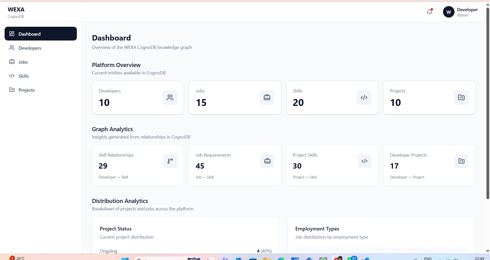
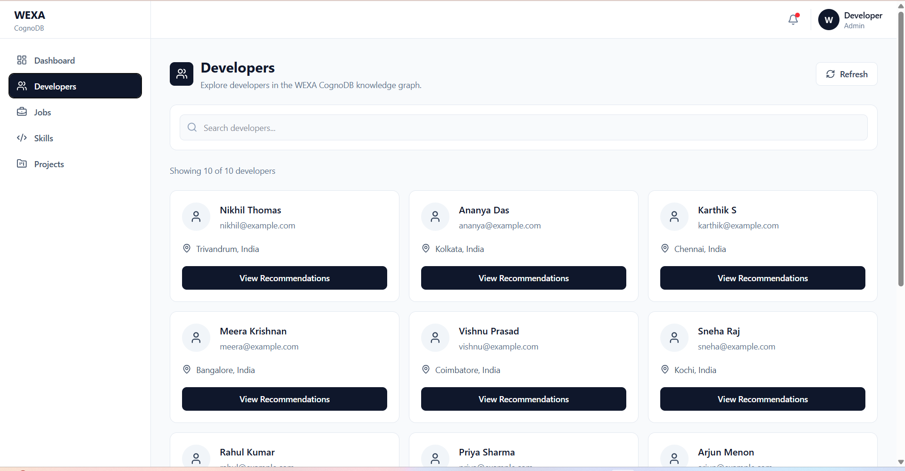
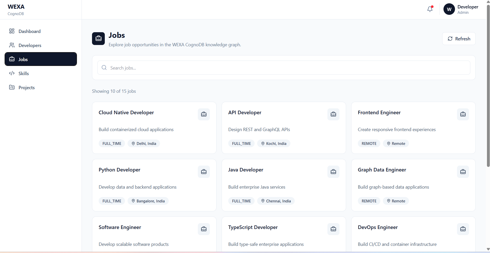
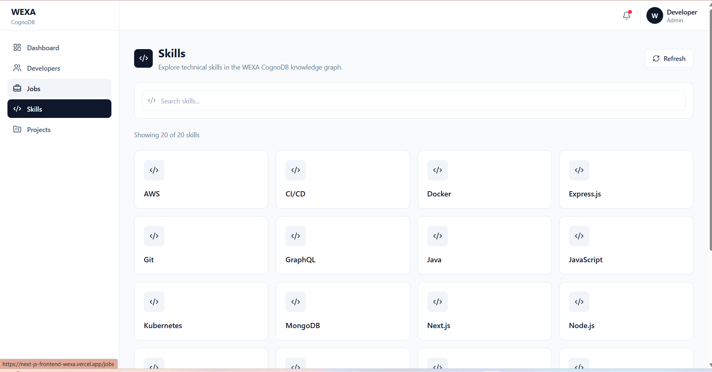
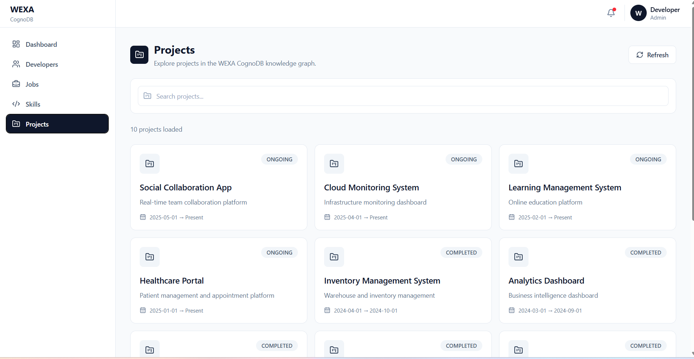
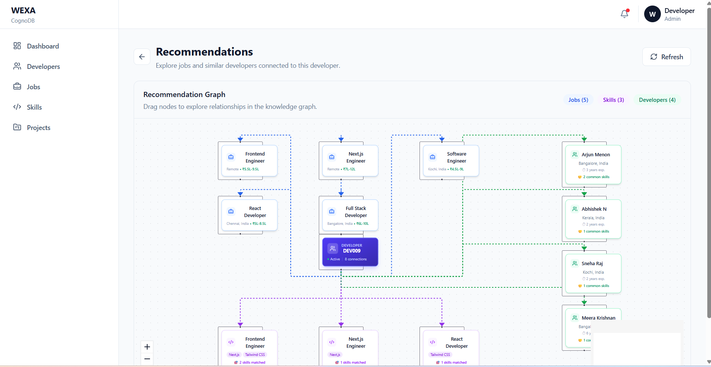

WEXA CognoDB — Frontend

A React + TypeScript frontend for the WEXA CognoDB graph database application.

The application provides a user-friendly interface for exploring developers, skills, jobs, projects, and graph-based recommendations backed by CognoDB.
Live Frontend API URL LIVE LINK:

https://next-js-frontend-wexa.vercel.app/

Live Backend API

The frontend is connected to the deployed backend:

https://next-js-backend-wexa.onrender.com

API base URL:

https://next-js-backend-wexa.onrender.com/api

The backend is hosted on Render and communicates with CognoDB through the official Neo4j driver.

Application Features

The frontend provides:

Dashboard
Developer listing
Developer search
Developer infinite scrolling
Job listing
Job search
Job pagination
Skills listing
Skill search
Skill infinite scrolling
Projects listing
Project search
Project pagination
Developer recommendations
Related-skill job recommendations
Similar developer recommendations
Interactive recommendation graph
Loading states
Empty states
Error states
Refresh functionality
Responsive UI
Technology Stack
React 19
TypeScript
Vite
Tailwind CSS v4
TanStack React Query
Axios
React Router
Lucide React
@xyflow/react / React Flow

The assignment requires a functional web application with intentional UI/UX, readable typography, loading states, empty states, and graceful error handling.

Frontend Folder Structure
frontend/
│
├── public/
│
├── src/
│   │
│   ├── assets/
│   │
│   ├── components/
│   │   ├── common/
│   │   │   ├── ErrorStates.tsx
│   │   │   └── LoadingSpinner.tsx
│   │   │
│   │   └── hooks/
│   │       └── useDebounce.ts
│   │
│   ├── features/
│   │   │
│   │   ├── api/
│   │   │   └── api.ts
│   │   │
│   │   ├── Dashboard/
│   │   │
│   │   ├── Developers/
│   │   │   ├── data/
│   │   │   ├── domain/
│   │   │   └── presentation/
│   │   │
│   │   ├── Jobs/
│   │   │   ├── data/
│   │   │   ├── domain/
│   │   │   └── presentation/
│   │   │
│   │   ├── Skills/
│   │   │   ├── data/
│   │   │   ├── domain/
│   │   │   └── presentation/
│   │   │
│   │   ├── Projects/
│   │   │   ├── data/
│   │   │   ├── domain/
│   │   │   └── presentation/
│   │   │
│   │   └── Recommendations/
│   │       ├── data/
│   │       ├── domain/
│   │       └── presentation/
│   │
│   ├── App.tsx
│   ├── App.css
│   ├── index.css
│   └── main.tsx
│
├── package.json
├── vite.config.ts
├── tsconfig.json
├── tsconfig.app.json
├── tsconfig.node.json
└── README.md
Frontend Architecture

The application follows a presentation/domain/data separation.

Page
  ↓
Presentation Hook
  ↓
Domain Use Case
  ↓
Domain Repository Interface
  ↓
Data Repository Implementation
  ↓
Axios API Client
  ↓
Backend API
  ↓
CognoDB

For example, the Developers feature follows:

DevelopersPage
    ↓
useDevelopers()
    ↓
GetDevelopers
    ↓
DeveloperRepository
    ↓
DeveloperRepositoryImpl
    ↓
API Client
    ↓
GET /api/developers
    ↓
Express Backend
    ↓
CognoDB

The same architecture is used for:

Developers
Jobs
Skills
Projects
Recommendations
Application Routes
/                         Dashboard
/developers               Developers
/jobs                     Jobs
/skills                   Skills
/projects                 Projects
/recommendations/:id      Developer Recommendations

Example:

/recommendations/DEV001

The developer ID is taken from the URL using React Router and passed to the recommendation hooks.

Search and Pagination

Developers and Skills use infinite scrolling.

The search flow is:

User types search
      ↓
useDebounce()
      ↓
React Query queryKey
      ↓
API request
      ↓
First page
      ↓
IntersectionObserver
      ↓
fetchNextPage()
      ↓
Next page

Example:

GET /api/developers?page=1&limit=10&search=react

Skills use the same pattern:

GET /api/skills?page=1&limit=10&search=react

Jobs and Projects use page-based pagination.

Example:

GET /api/jobs?page=1&limit=10&search=developer
GET /api/projects?page=1&limit=10&search=web

The frontend keeps the current data while a new search/page request is being fetched where appropriate, providing a smoother user experience.

Recommendation Graph

The recommendation page uses:

useDeveloperJobs()
useRelatedSkillJobs()
useSimilarDevelopers()

The flow is:

/recommendations/:developerId
          ↓
Recommendation Hooks
          ↓
Recommendation Repository
          ↓
Backend Recommendation APIs
          ↓
Recommendation Results
          ↓
Graph Node/Edge Mapping
          ↓
React Flow

The graph represents:

                         ┌───────────────┐
                         │   Developer   │
                         └───────┬───────┘
                                 │
              ┌──────────────────┼──────────────────┐
              │                  │                  │
              ▼                  ▼                  ▼
       Matching Jobs       Related Skill Jobs   Similar Developers
              │                  │
              ▼                  ▼
           Company         Related Skills

React Flow provides:

Interactive nodes
Relationship edges
Direction arrows
Zoom controls
MiniMap
Dragging
Responsive graph layout
Automatic fitView

The graph data is generated from recommendation API responses and is not hard-coded.

Recommendation Data Mapping

The recommendation APIs return nested objects.

For example:

{
  job: {
    id,
    title,
    location
  },
  company: {
    id,
    name,
    industry
  },
  matchedSkills
}

The frontend maps these properties into graph nodes.

Unique IDs are generated from actual entity IDs:

developer-DEV001
developer-job-JOB001
developer-skill-job-JOB013
developer-company-COMP001
developer-similar-DEV006

This prevents duplicate React keys and ensures graph edges connect to existing nodes.

Backend API

Production backend:

https://next-js-backend-wexa.onrender.com

API base:

https://next-js-backend-wexa.onrender.com/api
Dashboard
GET /api/dashboard/stats
Developers
GET /api/developers
GET /api/developers/:id
GET /api/developers/:id/skills
GET /api/developers/:id/projects
GET /api/developers/:id/companies
GET /api/developers/skill/:skillId

Search:

GET /api/developers?page=1&limit=10&search=react
Jobs
GET /api/jobs
GET /api/jobs/:id
GET /api/jobs/:id/skills
GET /api/jobs/:id/company

Search:

GET /api/jobs?page=1&limit=10&search=developer
Skills
GET /api/skills
GET /api/skills/:id
GET /api/skills/:id/related
GET /api/skills/:id/developers
GET /api/skills/:id/jobs

Search:

GET /api/skills?page=1&limit=10&search=react
Projects
GET /api/projects
GET /api/projects/:id
GET /api/projects/:id/skills
GET /api/projects/:id/developers

Search:

GET /api/projects?page=1&limit=10&search=web
Recommendations
GET /api/recommendations/developers/:developerId/jobs

GET /api/recommendations/developers/:developerId/related-jobs

GET /api/recommendations/jobs/:jobId/developers

GET /api/recommendations/developers/:developerId/similar
Environment Configuration

Create a .env file in the frontend project if the API URL is configured through Vite environment variables.

Example:

VITE_API_BASE_URL=https://next-js-backend-wexa.onrender.com/api

Do not commit secrets or private credentials.

Installation

Clone the repository and enter the frontend directory:

cd frontend

Install dependencies:

npm install

The recommendation graph requires:

npm install @xyflow/react

If @xyflow/react is already declared in package.json, a normal npm install is sufficient.

Run Development Server
npm run dev

Vite normally starts the application at:

http://localhost:5173

The frontend will communicate with:

https://next-js-backend-wexa.onrender.com/api
Production Build
npm run build
Preview Production Build
npm run preview
Lint
npm run lint
Error and Loading Handling

The application handles:

Loading
LoadingSpinner
API Error
ErrorStates
Empty Data

Each major feature displays a meaningful empty state when no records are available.

Refresh

Users can manually refresh API data using the Refresh button.

Why the Frontend Uses React Query

TanStack React Query manages server state including:

API requests
Caching
Query invalidation
Loading state
Error state
Refetching
Infinite queries
Pagination

This keeps API state separate from local UI state such as search inputs and navigation.

Development Flow

For a UI change:

Page
  ↓
Presentation Component
  ↓
Hook
  ↓
Use Case
  ↓
Repository
  ↓
API

For an API issue:

UI
  ↓
Hook
  ↓
Repository
  ↓
API Endpoint
  ↓
Backend
  ↓
CognoDB

For graph issues:

Recommendations Page
  ↓
Recommendation Hooks
  ↓
Recommendation Repository
  ↓
API Response
  ↓
Node/Edge Mapping
  ↓
React Flow
Troubleshooting
Frontend cannot reach backend

Check:

https://next-js-backend-wexa.onrender.com

and verify that the frontend API base URL is:

https://next-js-backend-wexa.onrender.com/api
Search appears to reload the page

Search should be handled as React state and passed through useDebounce().

The search flow should not perform a browser navigation.

Recommendation graph is empty

Check:

A valid developer ID is present in the URL.
Recommendation APIs return data.
The API response is mapped correctly.
job.id is used for job nodes.
company.id is used for company nodes.
developer.id is used for developer nodes.
Every node has a unique ID.
Every edge references an existing source and target node.
Duplicate graph keys

Do not use:

developer-job-undefined

Use:

developer-job-JOB001
developer-skill-job-JOB013
developer-similar-DEV006
Objects rendered as React children

Do not render:

{company}

Use:

{company.name}

Similarly:

{job.title}
{developer.name}
Assignment Requirements Covered

The WEXA assignment requires a functional application backed by CognoDB, a thoughtful graph model, realistic seed data, multi-hop Cypher queries, parameterized Neo4j-driver queries, usable UI/UX, environment-based credentials, graceful database error handling, and README documentation.

This frontend provides the user-facing application for exploring that graph data.

Screenshots

Add screenshots of the following before final submission:

1. Dashboard
2. Developers page
3. Jobs page
4. Skills page
5. Projects page
6. Recommendation graph

The assignment specifically asks for screenshots of the UI in the README.

Summary

WEXA CognoDB uses a React frontend to turn graph relationships into an interactive application.

The frontend communicates with the Express backend, which queries CognoDB.

The main flow is:

React
  ↓
TanStack React Query
  ↓
Repository
  ↓
Axios
  ↓
Express API
  ↓
Neo4j Driver
  ↓
CognoDB

The recommendation graph demonstrates the main advantage of the graph-based approach by visually connecting developers, skills, jobs, companies, and related developers.

## Screenshots

### 1. Dashboard

### 2. Developers

### 3. Jobs

### 4. Skills

### 5. Projects

### 6. Recommendations & Knowledge Graph

#### Screen Recordings

inside screenrecordings folder